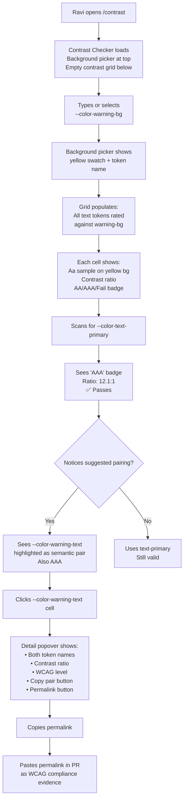
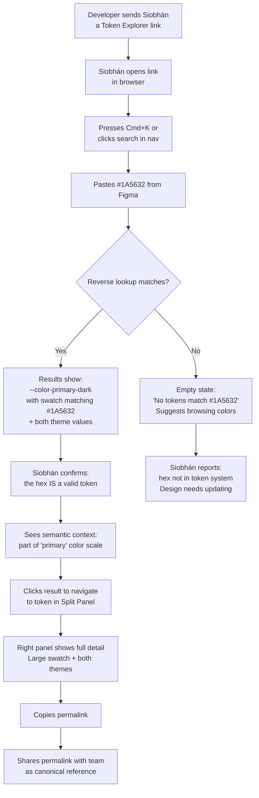

# UX Design Specification theme-govie-tokens

**Author:** Matteo
**Date:** 2026-04-10

---

<!-- UX design content will be appended sequentially through collaborative workflow steps -->

## Executive Summary

### Project Vision

Gov.ie Design System Token Explorer is a zero-friction static web application that gives NearForm developers a single, authoritative, visual reference for Gov.ie design system CSS tokens. It replaces the current workflow of searching Figma files or asking designers with a fast, keyboard-first interface that parses tokens directly from the CSS source of truth. The tool is built for daily use — not as a passive catalog, but as an active design system companion with fuzzy search, reverse lookup, WCAG contrast checking, and side-by-side light/dark theme comparison.

The UX must serve a spectrum from "I need this exact token in 4 seconds" (power user with Cmd+K) to "I just joined, show me everything" (onboarding browse). The interaction design challenge is making both ends of that spectrum feel native rather than compromised.

### Target Users

**Primary: NearForm Frontend Developers (Gov.ie contractors)**
- Technical skill: Intermediate to senior frontend developers comfortable with CSS custom properties, React, and keyboard shortcuts
- Context of use: Desktop, alongside VS Code, during active development — wide screens, mouse + keyboard
- Core need: Find and copy the correct token faster than asking a designer or searching Figma
- Frequency: Multiple times daily during active Gov.ie development

**User Personas:**

| Persona | Role | Primary Goal | Key Interaction |
|---------|------|-------------|-----------------|
| Liam | Senior dev, mid-flow | Find a known token fast | Cmd+K → fuzzy search → copy |
| Aoife | Mid-level dev, new layout | Understand available scale | Category browse → visual scan → copy |
| Ravi | Dev, accessibility-conscious | Verify WCAG compliance | Contrast checker → matrix → copy pairing |
| Niamh | Junior dev, onboarding | Learn the token system | Landing page → category browse → absorb structure |
| Siobhán | Designer (non-coder) | Verify a value maps to a token | Reverse lookup → confirm → share permalink |

**Secondary: Gov.ie Designers**
- Non-technical, working in Figma
- Need visual confirmation that hex values / design decisions map to real tokens
- Interact via permalinks shared by developers, or reverse lookup by value
- Must not be intimidated by a developer-facing tool

### Key Design Challenges

1. **Information density vs. scannability** — Each token carries multiple data points (name, category, light value, dark value, visual preview, copy action, permalink). The UI must present all of this without clutter, and different token categories (color, spacing, typography, border, shadow) require distinct visual treatments rather than a uniform card layout.

2. **Keyboard-first without excluding mouse users** — Command palette and shortcuts must be the fast path for power users while remaining invisible to casual browsers. Shortcut discoverability needs thoughtful progressive disclosure.

3. **Side-by-side dual-theme display** — Showing light and dark resolved values simultaneously doubles visual information. The layout must make comparison instant and intuitive without overwhelming the scan pattern.

4. **Five journeys, one coherent interface** — Speed-focused lookup (Liam), exploratory browsing (Aoife/Niamh), accessibility verification (Ravi), and reverse value lookup (Siobhán) must all feel like first-class experiences within a single navigation architecture.

5. **Contrast checker usability** — The O(N²) color pair matrix could contain hundreds of entries. Smart filtering, semantic grouping, and clear visual hierarchy are essential to make this tool useful rather than just technically complete.

### Design Opportunities

1. **"Time to token" as a design metric** — The < 10 second discovery goal provides a concrete, testable benchmark that every layout and interaction decision can be evaluated against.

2. **Self-teaching interface** — The visual category browser, semantic grouping, and naming convention patterns can make the design system's structure self-evident. For onboarding users, the UX IS the documentation — no separate learning step needed.

3. **Permalinks as collaboration protocol** — Shareable token URLs turn the tool into a communication bridge between designers and developers, elevating it from personal reference to team utility.

4. **Neutral UI as canvas** — By deliberately not using Gov.ie tokens for its own styling, the tool creates a clean, distraction-free background against which token previews stand out. This constraint becomes a visual design advantage.

## Core User Experience

### Defining Experience

The atomic interaction that defines the Token Explorer is **find → confirm → copy**. A developer arrives with a token need (a name they half-remember, a value they want to verify, or a category they want to browse), visually confirms the right token through its preview and resolved values, and copies it to their clipboard. Total time target: under 10 seconds from page load to copied value.

The command palette (Cmd+K) is the highest-leverage interaction in the product. It is the equivalent of Spotlight search or VS Code's command palette — a muscle-memory shortcut that collapses the entire discovery flow into keystrokes. If this interaction is fast, accurate, and visually clear, the tool earns daily use. Everything else (category browsing, contrast checking, reverse lookup) serves users who don't yet know what they're looking for, but the command palette is the power user's primary — and often only — touchpoint.

### Platform Strategy

**Primary Platform:** Desktop web browser (Chrome, Firefox, Safari, Edge — latest 2 versions)

**Usage Context:** Wide-screen desktop alongside an IDE. The tool occupies a browser tab that developers switch to mid-task, use for seconds, and switch away from. It competes for attention with VS Code, Figma, terminal, and Slack — so it must deliver value before the developer's patience runs out.

**Input Model:** Mouse + keyboard, with keyboard as the optimized fast path. Touch input is not a design target. The responsive floor is tablet width for occasional quick-reference use, but all UX decisions optimize for ≥1280px viewports.

**Offline Capability:** Fully functional after first load. All token data is embedded in static assets at build time. No network dependency at runtime — the tool works identically on a plane as it does in the office.

**Deployment Model:** Zero-friction static site. No login, no installation, no build steps. A single URL that developers bookmark. This is a product constraint that is also a UX feature — the tool's accessibility IS its adoption strategy.

### Effortless Interactions

**Search-to-Copy Pipeline (must feel instant):**
- Cmd+K opens the command palette within 200ms
- Fuzzy search results appear within 100ms of each keystroke
- Results show visual previews inline (color swatch, spacing bar) so the developer confirms visually without clicking through
- One-click (or Enter key) copies `var(--token-name)` to clipboard with immediate visual feedback
- Total flow: Cmd+K → type 3-4 characters → Enter → done. Under 5 seconds.

**Visual Scanning (must feel self-evident):**
- Category pages use distinct visual treatments per token type — color swatches, spacing scale bars, typography samples, border previews, shadow elevations
- Tokens within a category are grouped by semantic intent (e.g., colors grouped as primary / secondary / warning / error / success)
- Value decorators (inline swatches, pixel values) are always visible — no hover or expand actions required

**Theme Comparison (must feel passive):**
- Light and dark resolved values are displayed side by side for every token, always
- No theme toggle, no tab switching — both values are part of the default view
- The comparison layout makes differences visually obvious at a glance

**Copy Interaction (must feel zero-friction):**
- Single click copies. No format selection modal (MVP is `var(--token-name)` only)
- Visual confirmation (brief animation or checkmark) appears instantly
- No toast notifications, no modals — the feedback is inline and ephemeral

### Critical Success Moments

1. **"That's the one" (Confirmation Moment)** — The developer sees the fuzzy search result with a visual preview (swatch, scale bar) and both theme values. They know it's the right token without leaving the search results or opening a detail view. This moment must happen within the first 3 results for common queries.

2. **"Oh, I get it" (Learning Moment)** — A new developer browses the color category page and sees tokens organized by semantic intent. The naming convention (`--color-{intent}-{element}`) becomes apparent from the visual grouping alone. No documentation reading required — the layout teaches the system.

3. **"This passes" (Compliance Moment)** — A developer checks the WCAG contrast matrix, finds their color pair, sees the AA/AAA badge, and copies a permalink to paste in their PR description. The tool provides evidence, not just information.

4. **"It's a real token" (Trust Moment)** — A designer pastes a hex value into reverse lookup and gets an instant, definitive match to a named token. Trust is earned because the data comes from the CSS source file, not a manually maintained list.

**Make-or-Break Flow:** The first Cmd+K search. If the expected token doesn't appear in the top results, or if results lack enough visual context to confirm the right choice, the tool loses trust immediately and the developer reverts to Figma/Slack.

### Experience Principles

1. **Speed is the feature** — Every interaction is measured against "faster than asking a designer." If it takes more than 10 seconds, the design has failed. This is not an aspiration — it is the product's reason to exist.

2. **Show, don't describe** — Tokens are inherently visual. Swatches, scale bars, and type samples replace documentation text. The interface teaches the design system through its layout, not through labels or help text.

3. **Always-visible context** — Light and dark values, copy buttons, and visual previews are always present in the default view. No hover-to-reveal, no collapsed panels, no mode switching required for core information. The tool respects that developers scan rather than read.

4. **Keyboard opens the fast lane, mouse opens the front door** — Power users get Cmd+K, arrow-key navigation, and shortcut-driven workflows. First-time users get category pages, visual browsing, and click-based exploration. Neither interaction path is a degraded version of the other.

5. **One click, done** — Copy, permalink, and filter actions complete in a single interaction. No confirmation dialogs, no multi-step flows, no settings to configure. Every action has exactly one step between intent and result.

## Desired Emotional Response

### Primary Emotional Goals

**Competence and flow preservation** — The dominant emotion the Token Explorer should evoke is effortless capability. The developer should feel like an expert of the Gov.ie design system, even if they joined the project yesterday. The tool makes them capable without requiring learning, and using it doesn't interrupt their coding flow. The emotional signature is: "I didn't have to stop thinking about my code."

Supporting emotional goals:

| Emotion | Trigger | Design Implication |
|---------|---------|-------------------|
| **Confidence** | "I know this is the right token" | Visual confirmation (swatches, dual-theme values) alongside every search result and listing |
| **Trust** | "This data is accurate" | Source-of-truth messaging — tokens parsed from CSS, not hand-maintained |
| **Efficiency** | "That was fast" | The 4-second Cmd+K → copy flow; no loading states, no intermediate steps |
| **Clarity** | "I understand the system" | Self-teaching layout — semantic grouping and naming patterns visible through structure |

### Emotional Journey Mapping

| Stage | Target Feeling | Risk Feeling | Mitigation |
|-------|---------------|-------------|------------|
| **First visit** (Niamh) | "This makes sense" — immediate orientation | "Where do I start?" — overwhelm | Clean landing page with category overview; clear visual hierarchy; no wall of tokens on first load |
| **Cmd+K search** (Liam) | "Got it" — instant competence | "Not found" — frustration, distrust | Fuzzy matching tolerates typos; results show visual previews; empty state suggests alternatives |
| **Category browsing** (Aoife) | "Now I see the whole picture" — clarity | "There's too much" — scanning fatigue | Semantic grouping within categories; visual breaks between groups; consistent card rhythm |
| **Contrast checker** (Ravi) | "I can prove this" — professional confidence | "I can't find my pair" — confusion | Pre-filtered by selected token; AA/AAA badges prominent; suggested pairings surface best options first |
| **Reverse lookup** (Siobhán) | "It exists, I was right" — validation | "No results" — dead-end anxiety | Tolerant matching (hex with/without #, case-insensitive); show nearest matches if no exact hit |
| **Return visit** (all) | "I know exactly where to go" — mastery | "What changed?" — disorientation | Stable layout across visits; URL state preserves last context; command palette always available |

### Micro-Emotions

**Critical micro-emotion pairs and where the design must land:**

- **Confidence over Doubt** — Every token display includes enough visual context (preview + both theme values + name) that the developer never second-guesses their choice. The data comes from the CSS source file, and this provenance should be quietly evident.

- **Trust over Skepticism** — Token accuracy is guaranteed by the build-time pipeline. The UI should feel authoritative — clean, precise, no stale data indicators, no "last updated" timestamps that invite suspicion. The absence of doubt is the goal.

- **Accomplishment over Frustration** — The copy confirmation (brief inline checkmark) provides a micro-moment of task completion. The developer got what they came for. This should feel like checking off a mental to-do, not like a celebration.

- **Calm over Anxiety** — The neutral UI, consistent layout, and always-visible information create a low-cognitive-load environment. No flashing elements, no notifications, no urgency signals. The tool is a calm reference shelf in a busy workday.

### Design Implications

**Emotion → Design Mapping:**

1. **Competence → Rich search results** — Command palette results must include visual previews (swatch, scale bar) and both theme values inline. The developer confirms the right token without clicking into a detail view. Feeling competent means never needing a second step.

2. **Trust → Visual source-of-truth indicators** — Subtle but present: a small note that tokens are parsed from `theme-govie` CSS at build time. Not a banner — a quiet confidence signal, like a "verified" badge. Present once (landing page or footer), not repeated.

3. **Efficiency → Minimal chrome** — The UI itself should feel like it's getting out of the way. Thin navigation, no sidebar, no breadcrumbs on category pages. The tokens ARE the content. Every pixel of chrome that isn't a token preview or a control is friction.

4. **Clarity → Semantic visual grouping** — Tokens grouped by intent (primary, secondary, warning, error, success) with clear visual separators. The grouping teaches the naming convention without any explanatory text. Layout IS documentation.

5. **Calm → Neutral, restrained palette** — The tool's own styling uses grays, whites, and subtle borders. No bright accent colors competing with token previews. The emotional register is "quiet reference book," not "interactive dashboard."

### Emotional Design Principles

1. **Quiet competence over flashy features** — The tool should make the developer feel smart, not make the tool feel clever. No animations that delay action, no easter eggs, no personality that competes with utility. The best compliment is "I forgot I was using a tool."

2. **Confirmation without celebration** — Copy feedback, search matches, and WCAG badges provide quick, understated confirmation. A checkmark, not a confetti animation. The emotional register matches a professional context — efficient, not playful.

3. **Trust through transparency** — The tool's accuracy comes from its build-time CSS parsing pipeline. This provenance should be visible but not loud — a single mention of the source, not repeated warnings about data freshness. Absence of doubt is more powerful than proof of correctness.

4. **Calm reduces cognitive load** — A developer using this tool is mid-task on something else. The emotional goal is to add zero cognitive overhead. Neutral colors, consistent layouts, predictable interactions, and no surprises. The tool should feel like an extension of the developer's own memory.

5. **Mastery through return visits** — Each visit should feel faster than the last. The command palette remembers nothing (stateless), but the developer's muscle memory builds. The stable, predictable interface rewards repeated use with increasing speed — the emotional payoff of expertise.

## UX Pattern Analysis & Inspiration

### Inspiring Products Analysis

**Tailwind CSS Documentation**
The reference standard for developer-facing design token documentation. Every utility class is presented as a self-contained unit: code, CSS output, and live visual preview in a single row. The color palette page uses large swatches grouped by shade with click-to-copy. Search is fast, prominent, and fuzzy. The layout teaches the naming system through its structure — no separate "how to use" guide needed.

**VS Code Command Palette**
The mental model for the Cmd+K interaction. Opens in under 200ms. Fuzzy matching handles typos, partial matches, and acronym patterns. Results are ranked by relevance with inline icons differentiating result types (commands, files, settings). The entire flow is keyboard-only: type → arrow → Enter. No mouse interaction required at any point. This is the speed benchmark for the Token Explorer's command palette.

**Raycast**
The aspirational model for thought-speed lookup. Sub-200ms response with rich result previews. Results appear incrementally as the user types. Contextual actions per result type. Escape dismisses instantly. The interaction feels like an extension of working memory rather than a separate application. Key lesson: show just enough per result (name + visual indicator + value) that the user rarely needs to drill into a detail view.

**Storybook (existing Gov.ie reference)**
The current design system companion at ds.services.gov.ie. Strong at component isolation and exploratory browsing with sidebar navigation and addon panels. However, optimized for workshop-style exploration rather than speed-focused lookup. Loading times are noticeable, sidebar navigation adds cognitive overhead for simple reference tasks. The Token Explorer should be the inverse: fast where Storybook is slow, focused where Storybook is broad.

**Coolors.co**
Color palette exploration with color as the dominant visual element. Large blocks fill the viewport — the color IS the interface, not a small swatch beside metadata. Contrast ratios appear inline on hover. Multiple export formats. Key lesson: for color tokens, let the color preview dominate the visual hierarchy. The contrast checker should feel as visual as Coolors — color blocks with numbers, not a spreadsheet.

**Linear**
The benchmark for keyboard-first application design. Every action has a keyboard shortcut. Cmd+K is the universal entry point. Zero loading spinners — the UI responds instantly. Minimal chrome with content filling the viewport. Animations are functional (communicate state changes), never decorative. Shortcut discoverability via `?` overlay that's available but never intrusive.

### Transferable UX Patterns

**Navigation Patterns:**

| Pattern | Source | Application in Token Explorer |
|---------|--------|------------------------------|
| Command palette as universal entry point | VS Code, Linear, Raycast | Cmd+K opens search from any page; searches across all token categories simultaneously |
| Category-based flat navigation | Tailwind docs | Top nav with category links (Colors, Spacing, Typography, etc.) — no nested sidebar |
| Keyboard shortcut overlay via `?` | Linear | Floating help that shows all available shortcuts; dismisses on any key |

**Interaction Patterns:**

| Pattern | Source | Application in Token Explorer |
|---------|--------|------------------------------|
| Visual preview in search results | Raycast, Tailwind | Each search result includes an inline swatch/preview + both theme values — no click-through required |
| Click-to-copy with inline confirmation | Tailwind, Coolors | Single click copies `var(--token-name)`; brief checkmark replaces the copy icon, then reverts |
| Fuzzy matching with typo tolerance | VS Code | Search for "bg secndary" still matches `--color-bg-secondary` |
| Incremental results as-you-type | Raycast | Results filter in real time, no submit button, no debounce delay perceptible to user |
| Escape to dismiss | Raycast, VS Code | Escape closes the command palette instantly from any state |

**Visual Patterns:**

| Pattern | Source | Application in Token Explorer |
|---------|--------|------------------------------|
| Color as the dominant visual element | Coolors | Color token pages use large swatches, not small dots; the preview IS the primary content |
| Self-contained token unit | Tailwind | Each token displayed as a complete unit: name + preview + values + copy action in one row/card |
| Minimal chrome, maximum content | Linear | Thin top nav, no sidebar, no breadcrumbs; tokens fill the viewport |
| Semantic grouping with visual separators | Tailwind | Tokens grouped by intent (primary, secondary, warning, etc.) with clear section breaks |
| Neutral background as canvas | Coolors | The tool's own UI recedes so token previews stand out with maximum contrast |

### Anti-Patterns to Avoid

1. **Storybook's sidebar tree navigation** — Deep nested trees add cognitive load for a lookup tool. Users must understand the hierarchy before they can find anything. Use flat category navigation instead.

2. **Tooltip-only information** — Hiding token values or previews behind hover tooltips punishes mobile/tablet users and slows keyboard navigators. All critical information must be visible by default.

3. **Modal confirmation for copy actions** — "Copied to clipboard!" toast notifications that stack or require dismissal. Use inline, ephemeral feedback (checkmark that auto-reverts) instead.

4. **Decorative animations** — Slide-in panels, fade transitions on route changes, or bouncing copy confirmations. Every animation must communicate state, not add personality. The emotional register is professional calm.

5. **Search-then-filter workflow** — Requiring users to search first, then filter results by category. The command palette should search across all categories simultaneously; category pages provide browsing, not filtered search.

6. **Small color previews** — Tiny 16px color dots next to token names. For a tool where visual confirmation is the primary trust signal, color previews must be large enough to evaluate at a glance (minimum 40px).

7. **Separate detail pages per token** — Clicking a token to see its full information on a new page. Every token should show all essential information (name, both values, preview, copy) inline. Detail pages break the scanning flow.

### Design Inspiration Strategy

**Adopt Directly:**

- VS Code/Raycast command palette paradigm — Cmd+K, fuzzy search, keyboard navigation, instant results with visual previews
- Tailwind's self-contained token unit — name + preview + value + copy as an atomic display element
- Linear's keyboard shortcut `?` overlay — discoverable but not intrusive
- Coolors' color-dominant visual hierarchy — large swatches for color tokens
- Click-to-copy with inline checkmark confirmation — Tailwind/Coolors pattern

**Adapt for Our Context:**

- Tailwind's search → adapt for bidirectional search (name AND value/reverse lookup) in a single input
- Raycast's rich result previews → adapt for dual-theme display (light + dark values side by side in each result)
- Linear's minimal chrome → adapt with thin top navigation that includes category links (our routes) and a search trigger
- Coolors' contrast display → adapt into a full WCAG matrix with AA/AAA badges and filterable pairings

**Explicitly Avoid:**

- Storybook's sidebar tree navigation and heavy chrome
- Any tooltip-dependent information architecture
- Toast notification patterns for high-frequency actions (copy)
- Decorative animations or transitions that add latency
- Small color previews that undermine visual confirmation

## Design System Foundation

### Design System Choice

**Tailwind CSS v4.2 utility-first with a custom neutral theme — no component library.**

This project uses Tailwind CSS as its sole styling foundation. No UI component library (MUI, Chakra, Radix, shadcn/ui) is included. All components are built from scratch using Tailwind utility classes and semantic HTML.

### Rationale for Selection

| Factor | Decision Driver |
|--------|----------------|
| **Brand requirement** | The tool must be deliberately neutral — a brandless canvas so Gov.ie token previews are the visual focus. No existing component library ships this aesthetic. |
| **JS budget** | 200KB gzipped total. Component libraries consume 50–150KB before any app code. Tailwind utilities are CSS-only (zero JS). |
| **Component count** | ~10 custom components total (nav, search input, command palette, token card variants, contrast matrix, copy button, category chips, permalink). Not enough to justify a library's abstraction cost. |
| **Timeline** | Two-day solo build. Learning a component library's API costs more than building 10 focused components with Tailwind. |
| **Accessibility** | WCAG compliance achieved through semantic HTML (`<button>`, `<nav>`, `<main>`, heading hierarchy), Tailwind's focus-visible utilities, and `prefers-reduced-motion` / `prefers-color-scheme` media queries. No library needed for this. |
| **Architecture alignment** | Tailwind CSS v4.2 with `@theme` directives is already specified in the architecture document. Adding a component library would introduce a competing abstraction. |

### Implementation Approach

**Neutral Theme Definition (via Tailwind `@theme` in `globals.css`):**

- Background: white (`#ffffff`) and light gray (`#f9fafb`) for alternating sections
- Text: near-black (`#111827`) for primary, medium gray (`#6b7280`) for secondary
- Borders: light gray (`#e5e7eb`) — subtle, consistent, never competing with token previews
- Interactive states: slate blue accent for focus rings and active navigation — muted enough to not compete with color token swatches
- No brand colors — the tool's palette is intentionally monotone

**Component Strategy:**

All components are hand-built with Tailwind utilities. No shared component library, no design system package. Components are co-located with their routes or in `src/components/` for shared elements.

| Component | Approach |
|-----------|----------|
| `AppNav` | Semantic `<nav>` with Tailwind flexbox, category links as anchor tags |
| `CommandPalette` | `<dialog>` element + Tailwind positioning, Fuse.js for search, keyboard event handlers |
| `TokenCard` | Flexbox row with token name, dual-value display, copy button — base component extended per category |
| `ColorSwatch` | `<div>` with inline `backgroundColor` from token value, fixed dimensions (min 40px) |
| `SpacingScale` | Horizontal bar with `width` set from token value, labeled with pixel value |
| `TypographySample` | Text sample styled with token's font properties |
| `ContrastMatrix` | CSS Grid of color pair cells with AA/AAA badge overlays |
| `SearchInput` | Standard `<input>` with Tailwind styling, debounce-free Fuse.js integration |
| `CopyButton` | `<button>` with clipboard API, inline checkmark state swap |
| `CategoryChips` | Flexbox row of `<button>` elements with active/inactive Tailwind variants |

### Customization Strategy

**No customization layer needed.** The neutral theme is defined once in `globals.css` via Tailwind's `@theme` directive and consumed directly by utility classes throughout. There is no theming system, no dark mode for the tool itself, and no user-configurable appearance settings.

The only dynamic styling in the application is the token previews themselves — inline styles (`backgroundColor`, `width`, `fontSize`, etc.) applied from the parsed token values. These are intentionally outside the Tailwind system because they render the Gov.ie tokens, not the tool's own design.

**Design Consistency Rules:**
- All tool chrome uses Tailwind utilities referencing the neutral `@theme` values
- All token previews use inline styles from parsed CSS values
- These two styling domains never mix — the tool's UI and the token previews are visually separate systems

## Defining Core Interaction

### Defining Experience

**"Press Cmd+K, type what you're looking for, see the answer with visual proof, copy it."**

This is the Token Explorer's signature interaction — the one developers will describe when recommending the tool to a colleague. It collapses a 2-3 minute multi-app workflow (Figma → CSS file → grep → copy) into a 4-second keyboard flow within a single browser tab.

The defining experience is not search alone, and not copy alone — it is the seamless chain: **invoke → type → visually confirm → copy**. Each step must flow into the next without hesitation, decision points, or mode changes.

### User Mental Model

**Current Problem-Solving Approaches:**

| Approach | Time | Accuracy | Flow Impact |
|----------|------|----------|-------------|
| Open Figma → find hex → grep CSS file → find variable name | 2-3 min | Medium (Figma may be stale) | Severe — context switch to two other apps |
| Ask designer/senior dev in Slack | Minutes to hours | High (if they're available) | Severe — blocked on async response |
| Memorize common tokens, guess at others | Instant | Low (corrected in code review) | None, but creates rework |
| Search CSS file directly in IDE | 30-60s | High | Moderate — leaves current file, requires knowing naming patterns |

**Mental Model Developers Bring:**

Developers arrive with the **Cmd+K paradigm** already internalized from daily tools:

- **VS Code** — Cmd+P for files, Cmd+Shift+P for commands
- **Raycast/Spotlight** — system-wide search-and-act
- **Linear** — Cmd+K for everything
- **Browser DevTools** — Cmd+Shift+P for command menu

They expect: **invoke → type → select → act**. No onboarding needed for the interaction pattern. The Token Explorer must meet this existing expectation with zero friction — any deviation from the Cmd+K mental model (delayed results, unexpected navigation, required clicks between steps) will feel broken.

**What's Different (Our Unique Twist):**

Standard command palettes return **text results** — file names, command labels, issue titles. The Token Explorer's command palette returns **visual results** — each result includes an inline preview (color swatch, spacing bar, type sample) alongside the token name and both theme values. The developer doesn't just find the token — they **visually verify** it's the right one before committing.

This visual confirmation step is the novel element that transforms a search tool into a trust-building tool. It eliminates the "is this actually the right token?" doubt that persists in every current workflow.

### Success Criteria

**The core interaction succeeds when:**

1. **Speed** — The full invoke → type → confirm → copy flow completes in under 5 seconds. The developer's coding thought is still in working memory when they return to their editor.

2. **First-result accuracy** — For common queries (token names, partial names, semantic terms like "primary", "warning", "background"), the correct token appears in the top 3 results. The developer never scrolls past the fold in the results list.

3. **Visual sufficiency** — The search result row contains enough visual information (preview + name + both theme values) that the developer never needs to click through to a detail view or category page to confirm their choice.

4. **Copy confidence** — After copying, the developer trusts the value is correct and pastes it directly into their code without double-checking. Trust comes from: (a) visual preview matched expectation, (b) data is from the CSS source file.

5. **Return speed** — On the second and subsequent uses, the flow feels faster because the developer's muscle memory is reinforced by a completely predictable interface. Same shortcut, same result position, same copy action.

**Failure Indicators:**
- Developer types a query and scans past the 5th result → fuzzy matching needs tuning
- Developer clicks a result to "see more" before copying → result row is informationally incomplete
- Developer copies a token but then checks the CSS file to verify → trust has not been established
- Developer uses the tool once and reverts to Figma → the speed or accuracy didn't beat the old workflow

### Novel UX Patterns

**Pattern Classification: Established foundation with a novel visual layer.**

The Token Explorer does not invent a new interaction paradigm. It combines three proven patterns — command palette (VS Code), visual search results (Raycast), and click-to-copy (Tailwind docs) — into a single flow optimized for design token discovery.

**Established Patterns (adopt directly):**

| Pattern | Source | No education needed |
|---------|--------|-------------------|
| Cmd+K invocation | VS Code, Linear, Raycast | Developers already reach for this reflexively |
| Fuzzy text matching | VS Code, Fuse.js | Typo tolerance and partial matching are expected |
| Arrow key navigation in results | Every command palette | Up/Down/Enter is universal |
| Click-to-copy with checkmark feedback | Tailwind, GitHub | Single click → brief confirmation → done |

**Novel Combination (our unique value):**

| Element | What's New | Why It Matters |
|---------|-----------|----------------|
| Visual previews in command palette results | Color swatch / spacing bar / type sample inline with each result | Converts search from "find by name" to "find AND verify visually" |
| Dual-theme values in every result | Light + dark resolved values shown side by side | Eliminates "which theme am I looking at?" ambiguity |
| Bidirectional search | Same input searches token names AND raw values (reverse lookup) | Siobhán can paste `#1A5632` and find `--color-primary-dark` |

**Education Strategy:** None needed. The patterns are familiar; the visual enrichment is self-evident. A first-time user who presses Cmd+K and types will immediately see results with previews — no tooltip, no tutorial, no onboarding modal. The novelty is additive, not disruptive.

### Experience Mechanics

**1. Initiation**

| Trigger | Context | Behavior |
|---------|---------|----------|
| Cmd+K / Ctrl+K | Any page in the app | Command palette modal opens, centered, with empty text input focused |
| Click search icon in nav | Any page | Same modal opens |
| `/` key | Any page (when no input is focused) | Same modal opens (developer convention from GitHub, Slack) |

The palette opens within 200ms (NFR4). Background content dims with a semi-transparent overlay. Focus is trapped inside the modal until dismissed.

**2. Interaction**

| User Action | System Response | Timing |
|-------------|----------------|--------|
| Types characters | Results filter in real time via Fuse.js fuzzy search | < 100ms per keystroke (NFR3) |
| ↓ / ↑ arrow keys | Highlighted result moves; selected result is visually distinguished | Instant |
| Enters a raw value (e.g., `#1A5632`, `16px`) | Reverse lookup: results show tokens whose resolved values match | Same timing as name search |
| Sees results | Each result row shows: mini preview (swatch/bar) + token name + light value + dark value | Rendered in the same pass as filtering |

**Result Row Anatomy:**

```
┌─────────────────────────────────────────────────────────┐
│ [■ swatch] --color-bg-secondary    #f3f4f6 │ #1f2937  │
│            ↑ token name            ↑ light    ↑ dark    │
└─────────────────────────────────────────────────────────┘
```

For non-color tokens (spacing, typography), the mini preview adapts: a small horizontal bar for spacing, a font sample ("Aa") for typography.

**3. Feedback**

| Signal | Mechanism |
|--------|-----------|
| Results appearing as user types | Confirms search is working; empty state shows "No tokens match" with suggestion to try broader terms |
| Visual preview matches expectation | Developer's eyes confirm before their hand acts — the swatch IS the feedback |
| Highlighted result row | Current selection is visually distinct (subtle background highlight, not a heavy border) |
| Copy confirmation | After Enter or click-to-copy: checkmark icon replaces copy icon for 1.5 seconds, then reverts. No toast. |

**4. Completion**

| Action | Result | What Happens Next |
|--------|--------|-------------------|
| Press Enter on highlighted result | `var(--token-name)` copied to clipboard; checkmark shown; palette stays open | Developer can copy another token or press Escape |
| Click copy button on a result | Same as Enter | Same behavior |
| Press Escape | Palette closes immediately | Developer returns to the page they were on |
| Click outside the palette | Palette closes | Same as Escape |

**Design Decision:** The palette stays open after a copy action. This allows the developer to copy multiple tokens in one session (e.g., a background and a text color for a component) without re-invoking. Escape is the explicit dismiss. This matches Raycast's behavior.

## Visual Design Foundation

### Color System

**NearForm Brand Palette — Applied to Token Explorer**

The Token Explorer adopts NearForm's brand identity, creating a professional tool that feels like part of the NearForm ecosystem. The deep navy + green accent combination provides a distinctive, confident canvas against which Gov.ie token previews stand out clearly.

**Primary Colors:**

| Role | Token | Hex | Usage |
|------|-------|-----|-------|
| Primary background (dark sections) | `--color-nf-deep-navy` | `#000e38` | Nav bar, command palette overlay, dark surface areas |
| Page background | `--color-white` | `#ffffff` | Main content area — white canvas for token previews |
| Light surface | `--color-nf-light-grey` | `#f4f8fa` | Alternating section backgrounds, card backgrounds |
| Primary accent | `--color-nf-green` | `#00e6a4` | Active navigation, focus rings, copy confirmation, primary CTAs |
| Active accent | `--color-nf-dark-green` | `#07a06f` | Hover/pressed states on green elements |
| Accent surface | `--color-nf-light-green` | `#ccfaed` | Light green highlights, active chip backgrounds |

**Secondary Colors:**

| Role | Token | Hex | Usage |
|------|-------|-----|-------|
| Secondary accent | `--color-nf-purple` | `#9966ff` | Category chip accents, WCAG AAA badges |
| Selection highlight | `--color-nf-light-purple` | `#dfccff` | Text selection, search result highlight |
| Tertiary accent | `--color-nf-blue` | `#478bff` | Links, secondary actions, WCAG AA badges |
| Light blue surface | `--color-nf-light-blue` | `#d6e6ff` | Info banners, reverse lookup mode indicator |

**Neutral Colors:**

| Role | Token | Hex | Usage |
|------|-------|-----|-------|
| Primary text | `--color-nf-deep-navy` | `#000e38` | Body text on light backgrounds |
| Secondary text | `--color-nf-deep-grey` | `#444450` | Token values, metadata |
| Muted text | `--color-nf-muted-grey` | `#727783` | Placeholder text, tertiary information |
| Borders | `--color-nf-grey` | `#d9d9d9` | Card borders, dividers, input borders |
| Light text | `--color-white` | `#ffffff` | Text on dark navy backgrounds |

**Color Application Strategy:**

- **Navigation bar:** Deep navy background with white text and green active indicators — creates a strong branded header that frames the content
- **Content area:** White background with light grey alternating sections — clean canvas where Gov.ie token color swatches pop with maximum contrast
- **Command palette:** Deep navy overlay with green focus ring — matches nav, feels like a branded modal
- **Category chips:** Light green/purple/blue surfaces with deep navy text — color-coded by token category
- **Copy confirmation:** Green checkmark — instant, branded feedback
- **Focus rings:** NearForm green (`#00e6a4`) on all interactive elements — visible, accessible, on-brand
- **Text selection:** Light purple background — branded detail that reinforces identity

**Dark vs. Light Decision:** The tool uses a **light content area** (white/light grey) with a **dark branded chrome** (deep navy nav and command palette). This hybrid approach gives the best of both: NearForm brand presence through the chrome, and a clean white canvas where color token swatches, spacing visualizations, and typography samples render with maximum clarity and no color interference.

### Typography System

**Font Pairing: Bitter (serif) + Inter (sans-serif) — matching NearForm's site typography**

| Role | Font | Weight | Usage |
|------|------|--------|-------|
| **Page headings** | Bitter | Regular (400) | Category page titles ("Colors", "Spacing", "Typography"), landing page headings |
| **Section headings** | Bitter | Regular (400) | Semantic group labels ("Primary", "Warning", "Error"), contrast checker heading |
| **UI text** | Inter | Regular (400) / Medium (500) | Navigation links, chip labels, button text, metadata labels, search input |
| **Token names** | System monospace | Regular (400) | `--color-bg-secondary`, `--space-4` — always monospace for code fidelity |
| **Token values** | System monospace | Regular (400) | `#f3f4f6`, `16px`, `1.5rem` — monospace for alignment and scanning |
| **Body text** | Inter | Regular (400) | Descriptions, empty state messages, helper text |

**Type Scale:**

| Level | Size | Line Height | Font | Usage |
|-------|------|-------------|------|-------|
| Page title | 28px (text-[28px]) | 1.2em | Bitter | Category page heading |
| Section title | 21px (text-[21px]) | 1.3em | Bitter | Semantic group heading |
| UI large | 18px (text-lg) | 1.4em | Inter | Navigation active, summary stats |
| UI base | 16px (text-base) | 1.5em | Inter | Navigation, chips, buttons |
| Token name | 14px (text-sm) | 1.4em | Monospace | Token CSS variable name |
| Token value | 14px (text-sm) | 1.4em | Monospace | Resolved token values |
| Caption | 12px (text-xs) | 1.3em | Inter | Metadata, WCAG badges, keyboard hints |

**Typography Principles:**
- Bitter for hierarchy and brand voice — headings only, never in dense data areas
- Inter for everything interactive and functional — navigation, controls, labels
- Monospace for all token data — names and values must scan as code, not prose
- Letter spacing: NearForm's custom tight tracking (`-0.01em`) on headings for a polished feel
- Antialiased rendering (`-webkit-font-smoothing: antialiased`) matching the NearForm site

### Spacing & Layout Foundation

**Spacing System: 4px base unit (Tailwind default `--spacing: 0.25rem`)**

The layout prioritizes generous whitespace over information density. Each token card has room to breathe, and semantic groups are clearly separated. The tool should feel like a curated catalog, not a spreadsheet.

**Layout Principles:**

1. **Spacious over dense** — Generous padding around token cards (24–32px), clear separation between semantic groups (48–64px), and breathing room around the navigation. Developers scan better with whitespace than with cramped rows.

2. **Content width: max 1280px centered** — Matches a comfortable reading width on wide developer screens. Token grids fill the width; text content stays narrower.

3. **Vertical rhythm: consistent spacing scale** — Section gaps at 64px (`gap-16`), card gaps at 24px (`gap-6`), internal card padding at 16–20px (`p-4` to `p-5`). Predictable rhythm aids scanning.

4. **Grid-based token layout** — Token cards use CSS Grid: 2–3 columns on desktop depending on token type. Color swatches benefit from 3 columns (more visual scanning), spacing tokens from 2 columns (horizontal bar needs width).

**Key Spacing Values:**

| Element | Spacing | Tailwind |
|---------|---------|----------|
| Page horizontal padding | 40–48px | `px-10` to `px-12` |
| Section vertical gap | 64px | `gap-16` / `mt-16` |
| Semantic group gap | 48px | `gap-12` |
| Token card gap | 24px | `gap-6` |
| Card internal padding | 20px | `p-5` |
| Nav height | 64px | `h-16` |
| Command palette width | 640px max | `max-w-[640px]` |
| Color swatch minimum | 48px × 48px | `size-12` |

**Responsive Breakpoints (matching NearForm's site):**

| Breakpoint | Width | Layout Adjustment |
|------------|-------|-------------------|
| Desktop (default) | ≥1280px | Full grid, 2–3 column token cards, side-by-side theme values |
| Large tablet | ≥1024px | 2 column grid, side-by-side theme values maintained |
| Tablet | ≥768px | 1–2 column grid, theme values may stack |
| Below tablet | <768px | Single column, not a priority target |

### Accessibility Considerations

**Color Accessibility:**

- NearForm green (`#00e6a4`) on deep navy (`#000e38`): contrast ratio ~8.5:1 — passes AAA
- Deep navy text on white background: contrast ratio ~18:1 — passes AAA
- Deep grey (`#444450`) on white: contrast ratio ~9.5:1 — passes AAA
- Muted grey (`#727783`) on white: contrast ratio ~4.8:1 — passes AA for normal text
- All focus rings use NearForm green with 2px offset — visible on both dark and light backgrounds

**Focus & Keyboard Accessibility:**

- Focus ring style: `focus-visible:ring-2 focus-visible:ring-nf-green focus-visible:ring-offset-2` — matches NearForm's site pattern
- Focus outlines: `focus-visible:outline-none` with ring replacement — clean, visible, consistent
- All interactive elements receive focus in logical tab order
- Command palette traps focus while open, releases on Escape

**Motion & Preference Respect:**

- `prefers-reduced-motion`: disable the copy checkmark animation, command palette fade
- `prefers-color-scheme`: not applicable — the tool has a fixed light/dark hybrid design, not a system theme toggle
- No auto-playing animations, no parallax, no motion beyond functional state transitions

## Design Direction Decision

### Design Directions Explored

Six visual directions were generated and evaluated against the Token Explorer's core journeys and design principles:

| Direction | Layout | Strengths | Verdict |
|-----------|--------|-----------|---------|
| A: Card Grid | 3-column cards with dual swatches | Visual, spacious, good for onboarding | Too much visual weight for frequent use |
| B: Full-Width Rows | Tabular aligned columns | High density, fast vertical scanning | Efficient but lacks visual confirmation space |
| C: Hero Swatches | Color-dominant large split swatches | Beautiful, designer-friendly | Prioritizes aesthetics over developer efficiency |
| D: Dashboard | Sidebar + stats + compact grid | Overview-first, good for system understanding | Sidebar adds navigation complexity (anti-pattern) |
| **E: Split Panel** | **List + large detail preview** | **Browse + confirm + copy in one view** | **Selected — primary browsing layout** |
| **F: Contrast Checker** | **Background picker + rated text grid** | **WCAG verification with AA/AAA badges** | **Selected — dedicated /contrast route** |

The **Command Palette** (Cmd+K overlay) was evaluated separately as the defining interaction and selected as the primary entry point for all quick-lookup sessions.

### Chosen Direction

A three-mode interaction model built from the Command Palette, Direction E, and Direction F:

**Mode 1: Command Palette (Cmd+K)** — The default interaction. Deep navy overlay with fuzzy search, visual result previews (split light/dark swatches), dual-theme values, and instant copy. Covers 80% of sessions. Available from any page.

**Mode 2: Split Panel Browse (Category Pages)** — Left panel shows a filterable token list with small swatches and names. Right panel shows the selected token's large preview (200px split swatch), full metadata (both theme values), and a prominent copy button. Used when exploring a category, comparing tokens visually, or performing reverse lookup. Each category route (/colors, /spacing, /typography) uses this layout.

**Mode 3: Contrast Checker (/contrast)** — Select a background token, see all text tokens rated against it in a grid. Each cell shows the "Aa" sample rendered on the background, the computed contrast ratio, and an AA/AAA/Fail badge. Used for Ravi's accessibility verification journey.

### Design Rationale

1. **Command Palette first** — Matches the "time to token" priority. Developers who know what they want never leave the keyboard. The visual previews in results eliminate the need to navigate to a category page for confirmation.

2. **Split Panel for browsing** — The list+detail pattern gives the best of both worlds: compact scanning on the left (see many tokens at once) and spacious visual confirmation on the right (large swatch, no ambiguity). This avoids the card grid's visual noise while providing more detail than rows alone.

3. **Dedicated Contrast Checker** — WCAG verification is a distinct journey with different inputs (token pairs, not single tokens). It deserves its own route rather than being embedded in the browsing flow. The grid-of-cells layout makes it natural to scan many combinations at once.

4. **No sidebar navigation** — Direction D's sidebar was explicitly rejected. Top navigation tabs (Colors, Spacing, Typography, Borders, Shadows, Contrast, Cheatsheet) remain the only structural navigation, keeping the interface flat and predictable.

### Implementation Approach

**Shared Chrome (all modes):**
- Deep navy nav bar with Bitter serif logo, Inter nav links, and Cmd+K search trigger
- Top navigation for category switching — active state uses NearForm green
- Command Palette overlay accessible from every route

**Split Panel Layout (category pages):**
- Left panel: ~400px fixed width, scrollable token list with inline filter input, small swatches (36px), monospace token names, click to select
- Right panel: flexible width, centered large swatch (200px split light/dark), token name in monospace, light and dark values in code-styled boxes, prominent green copy button
- Selection state: light green background on selected list item, smooth transition
- Empty state (no selection): prompt to select a token or use Cmd+K

**Contrast Checker Layout (/contrast):**
- Background token picker at top (swatch + token name + suggested pairing)
- Grid of contrast cells below: 4-5 columns, each cell shows Aa sample rendered on the selected background, contrast ratio, and color-coded badge (green for AAA, blue for AA, red for Fail)
- Click a cell to copy the token pair or navigate to the token detail

**Responsive behavior:**
- Desktop (≥1024px): full split panel with both panels visible
- Tablet (≥768px): list panel collapses to icon-only or stacks above detail
- Mobile (<768px): single column, list view with tap-to-expand detail — not a priority target

## User Journey Flows

### Journey 1: Liam — Quick Token Lookup

**Goal:** Find and copy a known token in under 5 seconds without leaving flow.

**Entry:** Any page in the Token Explorer (bookmarked).

```mermaid
flowchart TD
    A[Liam lands on Token Explorer] --> B[Presses Cmd+K]
    B --> C[Command Palette opens\n200ms, focused input]
    C --> D[Types 'secondary background']
    D --> E[Fuzzy search returns results\n<100ms per keystroke]
    E --> F{Correct token in top 3?}
    F -->|Yes| G[Sees --color-bg-secondary\nwith split light/dark swatch]
    F -->|No| H[Refines query\n'bg second']
    H --> E
    G --> I[Visually confirms swatch\nmatches expected color]
    I --> J[Presses Enter]
    J --> K[var(--color-bg-secondary)\ncopied to clipboard]
    K --> L[Checkmark confirmation\n1.5s then reverts]
    L --> M{Need another token?}
    M -->|Yes| D
    M -->|No| N[Presses Escape]
    N --> O[Palette closes\nLiam returns to page]
```

**Key interactions:**

| Step | Action | UI Response | Time |
|------|--------|-------------|------|
| 1 | Cmd+K | Palette opens, input focused | 200ms |
| 2 | Type query | Results filter in real time | <100ms/keystroke |
| 3 | Visual scan | Split swatch confirms color | Instant |
| 4 | Enter | Value copied, checkmark shown | Instant + 1.5s feedback |
| 5 | Escape | Palette closes | Instant |

**Total time:** ~4 seconds. Palette stays open for multi-copy sessions.

---

### Journey 2: Aoife — Category Exploration

**Goal:** Understand the full spacing scale and pick appropriate tokens.

**Entry:** Token Explorer landing page or direct /spacing URL.

```mermaid
flowchart TD
    A[Aoife opens Token Explorer] --> B[Sees top nav: Colors, Spacing,\nTypography, Borders, Shadows, Contrast]
    B --> C[Clicks 'Spacing' tab]
    C --> D[Split Panel loads\nLeft: spacing token list\nRight: empty state prompt]
    D --> E[Left panel shows full spacing scale\n--space-1 through --space-16\nwith small horizontal bar previews]
    E --> F[Scans list vertically\nnotices 4px base pattern]
    F --> G[Clicks --space-6]
    G --> H[Right panel shows:\n• Large spacing bar visualization\n• Token name in monospace\n• Light value: 24px\n• Dark value: 24px\n• Copy button]
    H --> I[Clicks Copy button]
    I --> J[var(--space-6) copied\nCheckmark feedback]
    J --> K[Clicks --space-10 in list]
    K --> L[Right panel updates\nLarge bar shows 40px]
    L --> M[Clicks Copy]
    M --> N[var(--space-10) copied]
    N --> O[Aoife now understands\nthe spacing system]
```

**Key interactions:**

| Step | Action | UI Response |
|------|--------|-------------|
| 1 | Click nav tab | Split Panel loads with token list |
| 2 | Scan left panel | Tokens listed with mini previews, semantic groups visible |
| 3 | Click token in list | Right panel shows large preview + full metadata |
| 4 | Click Copy | Value copied, checkmark, selection stays |
| 5 | Click another token | Right panel updates smoothly |

**Learning moment:** The visual scale in the left panel (ascending horizontal bars) makes the 4px base unit self-evident. Aoife learns the system by browsing, not reading docs.

---

### Journey 3: Ravi — WCAG Contrast Verification

**Goal:** Verify a color pair meets WCAG AA and discover the recommended semantic pairing.

**Entry:** Direct navigation to /contrast or clicking "Contrast" in top nav.



**Key interactions:**

| Step | Action | UI Response |
|------|--------|-------------|
| 1 | Select background token | Grid populates with all text tokens rated |
| 2 | Scan grid | AA/AAA/Fail badges provide instant triage |
| 3 | Spot semantic pairing | Suggested pair highlighted distinctly |
| 4 | Click cell | Detail popover with copy + permalink options |
| 5 | Copy permalink | URL with both tokens encoded as parameters |

**Trust moment:** The contrast ratio is computed in the browser from the actual CSS values — not from a static table. Ravi trusts the result because it's derived from the source.

---

### Journey 4: Niamh — Onboarding Exploration

**Goal:** Understand the token system's scope, organization, and naming conventions within 5 minutes.

**Entry:** Token Explorer landing page (linked from onboarding doc).

```mermaid
flowchart TD
    A[Niamh opens Token Explorer\nfrom onboarding link] --> B[Landing page shows:\nOverview of all categories\nwith token counts]
    B --> C[Sees: Colors 42 · Spacing 16 ·\nTypography 12 · Borders 8 · Shadows 6]
    C --> D[Clicks 'Colors' — the largest\nand most visual category]
    D --> E[Split Panel loads\nLeft: color tokens grouped\nby semantic intent]
    E --> F[Sees groups:\nPrimary · Secondary ·\nWarning · Error · Success · Neutral]
    F --> G[Naming pattern clicks:\n--color-{intent}-{element}]
    G --> H[Clicks --color-primary]
    H --> I[Right panel: large swatch\nshowing both themes\nName + values + copy]
    I --> J[Clicks through several tokens\nbuilding mental model]
    J --> K[Tries Cmd+K out of curiosity]
    K --> L[Types 'warning'\nSees all warning tokens\nwith visual previews]
    L --> M[Presses Escape]
    M --> N[Explores Spacing and Typography\nvia nav tabs]
    N --> O[After 5 minutes:\nunderstands vocabulary,\nnaming, available options]
```

**Key interactions:**

| Step | Action | Learning Outcome |
|------|--------|-----------------|
| 1 | See landing overview | Scope: 84 tokens across 5 categories |
| 2 | Browse color groups | Organization: semantic intent grouping |
| 3 | Read token names | Convention: `--color-{intent}-{element}` |
| 4 | Compare light/dark swatches | Theming: every token has two values |
| 5 | Try Cmd+K | Speed: quick lookup for future use |

**Self-teaching design:** No tutorial, no onboarding modal, no documentation to read. The information architecture IS the tutorial — categories reveal scope, semantic groups reveal organization, token names reveal convention.

---

### Journey 5: Siobhán — Reverse Lookup

**Goal:** Verify a hex value from Figma maps to an actual token.

**Entry:** Permalink sent by a developer, or direct visit + paste.



**Key interactions:**

| Step | Action | UI Response |
|------|--------|-------------|
| 1 | Paste raw hex value | Reverse lookup: search by value, not name |
| 2 | See result with context | Token name + semantic group + visual preview |
| 3 | Click through to detail | Split Panel shows full metadata |
| 4 | Copy permalink | Shareable URL for design-dev communication |

**Bridging moment:** Siobhán never sees code. She sees colors, names, and visual context. The tool speaks both languages — hex values for designers, CSS variables for developers.

---

### Journey Patterns

**Common patterns extracted across all five journeys:**

**Navigation Patterns:**

| Pattern | Usage | Journeys |
|---------|-------|----------|
| Cmd+K as universal entry | Quick lookup from anywhere | Liam, Niamh, Siobhán |
| Top nav tab switching | Category browsing | Aoife, Niamh |
| Click-to-select in list | Token selection in Split Panel | Aoife, Niamh |
| Permalink sharing | Cross-tool communication | Ravi, Siobhán |

**Feedback Patterns:**

| Pattern | Mechanism | Journeys |
|---------|-----------|----------|
| Copy confirmation | Checkmark icon, 1.5s, no toast | All |
| Visual confirmation | Swatch matches expectation | Liam, Aoife, Siobhán |
| WCAG badge | Color-coded AA/AAA/Fail | Ravi |
| Empty state guidance | Helpful message + suggestion | Siobhán (no match) |

**Decision Patterns:**

| Pattern | Decision Point | Resolution |
|---------|---------------|------------|
| Search vs. browse | "Do I know the token name?" | Know it → Cmd+K. Don't know → nav tab + browse |
| Confirm vs. copy | "Is this the right token?" | Visual swatch + dual-theme values → confident copy |
| Pair suggestion | "Which text color for this bg?" | Contrast checker highlights semantic pairing |

### Flow Optimization Principles

1. **Zero-step onboarding** — Every journey begins without setup, login, or configuration. The URL IS the entry point. Bookmarks work. Permalinks work. No state to manage.

2. **Progressive disclosure by mode** — Cmd+K shows minimal info (swatch + name + values). Split Panel adds detail (large preview + copy button). Contrast Checker adds analysis (ratios + badges + suggestions). Users access only the depth they need.

3. **Palette stays open for multi-copy** — Liam and Aoife often need 2-3 tokens in one session. The Command Palette and Split Panel both support sequential copies without re-navigation.

4. **Failure states guide, not block** — When reverse lookup finds no match (Siobhán), the empty state suggests browsing colors rather than showing a dead end. When contrast fails (Ravi), the tool shows the recommended pairing as a constructive alternative.

5. **Permalinks as collaboration primitive** — Ravi uses them for WCAG evidence in PRs. Siobhán uses them for design-dev conversations. URLs encode enough state (token name, theme, contrast pair) to recreate the view exactly.

## Component Strategy

### Design System Components

**Foundation: Tailwind CSS v4.2 utility-first — no pre-built component library.**

Tailwind provides the styling primitives (colors, spacing, typography, layout, transitions) but zero pre-built UI components. Every interactive element is custom. This gives full control over the Token Explorer's unique requirements (split swatches, contrast grids, command palette) at the cost of building everything from scratch.

**What Tailwind provides:**

| Layer | What It Covers | How We Use It |
|-------|---------------|---------------|
| Color utilities | `bg-*`, `text-*`, `border-*` | NearForm brand palette via custom theme config |
| Layout | `flex`, `grid`, `gap-*`, `p-*`, `w-*` | Split Panel, token grids, spacing system |
| Typography | `font-*`, `text-*`, `leading-*` | Bitter headings, Inter UI text, monospace tokens |
| Transitions | `transition-*`, `duration-*` | Hover states, focus rings, palette open/close |
| Focus | `focus-visible:ring-*` | Green focus rings on all interactive elements |
| Responsive | `md:`, `lg:`, `xl:` | Breakpoint-driven layout shifts |

**What Tailwind does NOT provide (must build):**

- Command Palette with fuzzy search
- Split Panel with list+detail
- Color swatch with light/dark split
- Contrast checker grid
- Copy-to-clipboard with feedback
- WCAG badge component
- Keyboard navigation system

### Custom Components

#### CommandPalette

**Purpose:** Global search overlay for finding and copying tokens in <5 seconds. The primary interaction for 80% of sessions.

**Anatomy:**
- Overlay: semi-transparent deep navy backdrop, focus-trapped modal
- Search input: icon + text field + keyboard hint (Esc to close)
- Results list: scrollable, max 8 visible results
- Result row: mini swatch (32px, split light/dark) + token name (monospace) + light value + dark value + copy hint
- Footer: keyboard navigation hints (↑↓ navigate, ⏎ copy, esc close)

**States:**

| State | Behavior |
|-------|----------|
| Closed | Hidden, listening for Cmd+K / Ctrl+K / `/` |
| Open (empty) | Input focused, placeholder "Search tokens...", no results shown |
| Open (typing) | Results filter in real time (<100ms), first result highlighted |
| Open (navigating) | Arrow keys move highlight, highlighted row visually distinct |
| Open (copied) | Checkmark replaces copy hint on selected row for 1.5s, palette stays open |
| Open (no results) | "No tokens match [query]" with suggestion to try broader terms |

**Keyboard:**

| Key | Action |
|-----|--------|
| Cmd+K / Ctrl+K | Open (from any page) |
| `/` | Open (when no input focused) |
| Escape | Close |
| ↑ / ↓ | Move highlight |
| Enter | Copy highlighted token value |
| Type | Filter results |

**Accessibility:** `role="dialog"`, `aria-modal="true"`, `aria-label="Search tokens"`, focus trap, result list uses `role="listbox"` with `aria-activedescendant`.

#### SplitPanel

**Purpose:** Two-panel layout for category browsing. Left panel for token list, right panel for detail view.

**Anatomy:**
- Left panel: fixed ~400px width, scrollable, contains filter input + grouped token list
- Divider: 1px border, not resizable
- Right panel: flexible width, centered content

**States:**

| State | Left Panel | Right Panel |
|-------|------------|-------------|
| No selection | Full token list visible | Empty state: "Select a token or press Cmd+K" |
| Token selected | Selected item highlighted (light green bg) | Large preview + metadata + copy button |
| Filtering | List filters in real time | Maintains current selection if still visible |

#### TokenListItem

**Purpose:** Single token row in the Split Panel left list.

**Anatomy:** Mini preview (36px, type-specific) + token name (monospace, truncated) + secondary value text

**Variants by token type:**

| Token Type | Mini Preview | Secondary Text |
|------------|-------------|----------------|
| Color | 36px circle or rounded square, split light/dark | Hex value |
| Spacing | Small horizontal bar, width proportional | Pixel value |
| Typography | "Aa" in the token's font/weight/size | Font family + size |
| Border | Small square with the border style applied | Width + style |
| Shadow | Small square with the shadow applied | Shadow shorthand |

**States:** default, hover (light grey bg), selected (light green bg), keyboard-focused (green ring).

#### TokenDetail

**Purpose:** Large preview with full metadata in the Split Panel right panel.

**Anatomy:**
- Large preview (200px, type-specific visualization)
- Token name in monospace (18px)
- Value boxes: light theme value + dark theme value in code-styled rounded boxes
- Copy button: prominent green button "Copy var(--token-name)"
- Permalink button: secondary action, copies URL

**Variants by token type:**

| Token Type | Large Preview |
|------------|--------------|
| Color | 200×200px rounded square, split vertically (left=light, right=dark) |
| Spacing | Large horizontal bar with pixel ruler marks |
| Typography | Large text sample "The quick brown fox" in the token's style |
| Border | Large square demonstrating the border on all sides |
| Shadow | Large card demonstrating the shadow effect |

#### ColorSwatch

**Purpose:** Visual color preview showing both theme values. Used at multiple sizes across the app.

**Variants:**

| Size | Dimensions | Usage |
|------|-----------|-------|
| Mini | 32px | Command Palette result rows |
| Small | 36px | Split Panel token list |
| Large | 200px | Split Panel detail view |
| Contrast | 80×80px | Contrast Checker grid cells |

**Anatomy:** Two halves split vertically — left half shows light theme value, right half shows dark theme value. 1px white divider between halves. Border radius scales with size (6px mini → 16px large).

#### ContrastChecker

**Purpose:** WCAG contrast verification page at /contrast route.

**Anatomy:**
- Background picker: token selector at top (swatch + name + dropdown/search)
- Suggested pairing: secondary picker showing the semantic pair
- Contrast grid: 4-5 column grid of ContrastCell components
- Filter: optional filter for text tokens (all, passing only, failing only)

**States:**

| State | Behavior |
|-------|----------|
| No background selected | Prompt to select a background token |
| Background selected | Grid populates with all text tokens rated against it |
| Cell clicked | PairPopover opens with detail |

#### ContrastCell

**Purpose:** Single cell in the contrast checker grid showing one text-on-background combination.

**Anatomy:**
- Background: set to the selected background token color
- "Aa" sample: rendered in the cell's text token color (18px, bold)
- Contrast ratio: monospace, e.g., "7.2:1"
- WCAG badge: WcagBadge component (AAA/AA/Fail)
- Token name: small monospace text at bottom

**States:** default, hover (green border), clicked (opens PairPopover).

#### WcagBadge

**Purpose:** Color-coded accessibility level indicator.

**Variants:**

| Level | Background | Text | Condition |
|-------|-----------|------|-----------|
| AAA | Light green (`#ccfaed`) | Dark green (`#07a06f`) | Ratio ≥ 7:1 |
| AA | Light blue (`#d6e6ff`) | Blue (`#478bff`) | Ratio ≥ 4.5:1 |
| Fail | Light red (`#ffeaea`) | Red (`#cc3333`) | Ratio < 4.5:1 |

**Size:** Inline pill, 10px font, 2px/8px padding.

#### CopyButton

**Purpose:** Click-to-copy with visual feedback. Used across the entire app.

**Anatomy:** Button with copy icon → on click, icon changes to checkmark for 1.5s → reverts.

**Variants:**

| Variant | Usage | Style |
|---------|-------|-------|
| Primary | Token Detail panel | Green bg, deep navy text, prominent |
| Ghost | Token list items, Command Palette | No bg, grey text, appears on hover |
| Inline | Contrast Checker cells | Small icon only |

**Accessibility:** `aria-label="Copy token value"`, changes to `aria-label="Copied"` during feedback state.

#### EmptyState

**Purpose:** Helpful guidance when no content is available.

**Variants:**

| Context | Message | Suggestion |
|---------|---------|------------|
| No token selected (Split Panel) | "Select a token to see details" | "Or press Cmd+K for quick search" |
| No search results (Command Palette) | "No tokens match '[query]'" | "Try a broader search term" |
| No background selected (Contrast) | "Select a background token" | "Choose from the dropdown above" |

#### LandingOverview

**Purpose:** Landing page showing category cards with token counts and visual previews.

**Anatomy:** Grid of category cards, each showing: category icon/visual + category name (Bitter serif) + token count + mini preview sample.

### Component Implementation Strategy

**Build approach:** All components are React functional components with TypeScript, styled with Tailwind utility classes. No CSS modules, no styled-components, no external UI library.

**Shared patterns:**
- All interactive elements use `focus-visible:ring-2 focus-visible:ring-nf-green focus-visible:ring-offset-2`
- All hover states use `transition-colors duration-150`
- All copy actions use a shared `useCopyToClipboard` hook
- All token previews use a shared `TokenPreview` component that switches rendering by token type
- Keyboard navigation uses a shared `useKeyboardNavigation` hook

**State management:**
- URL state for: selected category, selected token, contrast background, search query
- React state for: command palette open/close, copy feedback timers, filter text
- No global state library needed — URL + local state covers all cases

### Implementation Roadmap

**Phase 1 — Core (MVP launch):**

| Component | Needed For | Priority |
|-----------|-----------|----------|
| CommandPalette | Liam's journey (primary flow) | Critical |
| SplitPanel | Aoife + Niamh browsing | Critical |
| TokenListItem | All category pages | Critical |
| TokenDetail | Visual confirmation + copy | Critical |
| ColorSwatch | Color token display (largest category) | Critical |
| CopyButton | Every copy action | Critical |
| NavBar | Page structure + navigation | Critical |
| LandingOverview | Niamh's onboarding entry | Critical |

**Phase 2 — Complete token support:**

| Component | Needed For | Priority |
|-----------|-----------|----------|
| SpacingBar | Spacing token previews | High |
| TypographySample | Typography token previews | High |
| BorderPreview | Border token previews | High |
| ShadowPreview | Shadow token previews | High |
| EmptyState | Graceful empty states | High |
| SemanticGroupHeader | Token grouping in lists | High |

**Phase 3 — Accessibility + collaboration:**

| Component | Needed For | Priority |
|-----------|-----------|----------|
| ContrastChecker | Ravi's WCAG journey | High |
| ContrastCell | Contrast grid | High |
| WcagBadge | Accessibility indicators | High |
| BackgroundPicker | Contrast background selection | High |
| PairPopover | Contrast detail + permalink | Medium |
| Permalink | Shareable URLs (Ravi + Siobhán) | Medium |

## UX Consistency Patterns

### Copy Feedback

The most frequent action in the app. Every copy interaction follows the same pattern regardless of where it occurs.

**Pattern:** Click or Enter → value copied to clipboard → visual confirmation → revert.

| Element | Specification |
|---------|--------------|
| Trigger | Click copy button OR press Enter on highlighted item |
| Clipboard content | `var(--token-name)` format by default |
| Visual feedback | Copy icon → green checkmark icon, 1.5s duration, then reverts |
| Audio feedback | None |
| Toast/snackbar | None — the inline checkmark is sufficient, no stacking notifications |
| Repeated copy | Same token can be copied again immediately after revert |
| Error handling | If clipboard API fails, show brief "Copy failed" text in place of checkmark, revert after 2s |

**Consistency rule:** The checkmark animation is identical everywhere — Command Palette result rows, Split Panel detail copy button, Contrast Checker cells. Same icon, same duration, same green color (`--nf-green`). No variation.

### Navigation

**Top Navigation Bar:**

| Element | Specification |
|---------|--------------|
| Structure | Logo (left) + category links (center-left) + search trigger (right) |
| Active state | NearForm green text, no underline, no background change |
| Hover state | White text (from 65% opacity default) |
| Current page | Active link matches current route |
| Keyboard | Tab cycles through nav links; Enter activates |

**Category Switching:**

| Behavior | Specification |
|----------|--------------|
| Transition | Instant page navigation (Next.js static), no loading spinner |
| State preservation | Selected token resets when switching categories |
| URL update | Route changes to `/colors`, `/spacing`, etc. |
| Back button | Browser back returns to previous category with previous selection |

**No breadcrumbs, no sidebar, no hamburger menu.** The app is flat — one level of navigation via top tabs. The command palette provides cross-cutting search that bypasses navigation entirely.

### Search & Filtering

**Two search contexts with consistent behavior:**

**Command Palette (global search):**

| Behavior | Specification |
|----------|--------------|
| Scope | All tokens across all categories |
| Input | Fuzzy search via Fuse.js |
| Matching | Token names AND raw values (reverse lookup) |
| Result order | Best fuzzy match first |
| Result limit | Display max 8, scroll for more |
| Highlighting | Matched characters highlighted in token name |
| Debounce | None — filter on every keystroke |

**List Filter (category page):**

| Behavior | Specification |
|----------|--------------|
| Scope | Tokens within the current category only |
| Input | Simple text filter (substring match) |
| Matching | Token names only |
| Result order | Maintains semantic group ordering |
| Clearing | "×" button in input to clear, or select all text + delete |
| Empty result | "No tokens match '[filter]' in [category]" |

**Consistency rule:** Both search contexts use the same monospace font for displaying token names, the same swatch style for previews, and the same highlight color (`--nf-light-purple`) for matched text.

### Focus & Keyboard Navigation

**Global keyboard shortcuts:**

| Shortcut | Action | Context |
|----------|--------|---------|
| Cmd+K / Ctrl+K | Open command palette | Any page, any state |
| `/` | Open command palette | When no input is focused |
| Escape | Close command palette / deselect token | Context-dependent |
| ↑ / ↓ | Navigate results or token list | When palette or list is focused |
| Enter | Copy selected token / confirm action | When an item is highlighted |
| Tab | Move focus to next interactive element | Standard tab order |

**Focus ring specification:**

| Property | Value |
|----------|-------|
| Style | `ring-2 ring-offset-2 ring-nf-green` |
| Visibility | `focus-visible` only (not on click for mouse users) |
| Color | NearForm green (`#00e6a4`) on all backgrounds |
| Offset | 2px gap between element and ring |

**Focus trap:** Command palette traps focus while open. Tab cycles within the modal (input → results → footer hints → input). Escape releases the trap and returns focus to the element that triggered the palette.

**Consistency rule:** Every interactive element in the app receives the same green focus ring. No exceptions. No custom focus styles per component.

### Empty States

All empty states follow the same structure: centered content, a brief message, and a constructive suggestion.

| Context | Icon | Message | Suggestion |
|---------|------|---------|------------|
| No token selected (detail panel) | Magnifying glass | "Select a token to see details" | "Or press Cmd+K for quick search" |
| No search results (palette) | Empty set | "No tokens match '[query]'" | "Try a broader search term" |
| No filter results (list) | Filter slash | "No tokens match '[filter]' in [category]" | "Clear filter to see all tokens" |
| No background selected (contrast) | Palette | "Select a background token to check contrast" | "Choose from the dropdown above" |

**Consistency rule:** All empty states use Inter regular at 14px, muted grey (`--nf-muted-grey`) for the message, and a secondary text line for the suggestion. No illustrations, no large icons — keep it minimal and scannable.

### Loading States

The app is a static export — token data is baked in at build time. There are no API calls, no spinners, no skeleton screens during normal use.

| Scenario | Handling |
|----------|---------|
| Initial page load | HTML renders instantly from static export; fonts load async (FOUT acceptable for <200ms) |
| Category switch | Instant navigation (static pages), no loading indicator |
| Search filtering | Synchronous Fuse.js computation, no loading state needed |
| Contrast calculation | Synchronous WCAG math, instant grid population |
| Clipboard write | Async but <50ms; checkmark appears on success |

**No loading pattern needed for MVP.** If future versions add dynamic data (e.g., fetching tokens from an API), use a simple pulse animation on the content area, not skeleton screens.

### Hover & Interactive States

**Consistent state progression for all interactive elements:**

| State | Visual Change |
|-------|--------------|
| Default | Base styling |
| Hover | Subtle background shift (light grey or light green depending on context) |
| Focus-visible | Green ring, 2px offset |
| Active/pressed | Slightly darker background than hover |
| Selected | Light green background (`--nf-light-green`), persists until deselected |
| Disabled | 50% opacity, `cursor-not-allowed` (rare — most elements are always interactive) |

**Timing:** All transitions use `duration-150` (150ms) with `ease-in-out`. No staggered animations, no spring physics — simple, predictable state changes.

### Overlay & Modal Pattern

Only one overlay in the app: the Command Palette.

| Property | Specification |
|----------|--------------|
| Backdrop | Deep navy at 60% opacity (`bg-nf-deep-navy/60`) |
| Position | Centered horizontally, offset ~20% from top |
| Width | Max 640px, responsive padding on smaller screens |
| Open animation | Fade in backdrop (150ms) + scale modal from 95% to 100% (150ms) |
| Close animation | Reverse of open (150ms) |
| Dismiss triggers | Escape key, click outside modal, explicit close |
| Scroll lock | Background page scroll disabled while modal is open |
| Nesting | No nested modals. Palette is the only overlay. |

**Consistency rule:** No other overlays, popovers, or modals in the MVP. The Contrast Checker's PairPopover (Phase 3) is the only exception — it appears as a small anchored popover, not a centered modal.

### URL State & Permalinks

All meaningful app state is encoded in the URL for shareability and bookmarkability.

| Route | URL Pattern | State Encoded |
|-------|------------|---------------|
| Landing | `/` | None |
| Category browse | `/colors` | Category |
| Token selected | `/colors?token=color-bg-secondary` | Category + token |
| Contrast checker | `/contrast?bg=color-warning-bg` | Background token |
| Contrast pair | `/contrast?bg=color-warning-bg&fg=color-text-primary` | Background + foreground |
| Search (deep link) | `/?q=secondary` | Opens palette with pre-filled query |

**Consistency rule:** All URL parameters use token names without the `--` prefix (shorter, cleaner URLs). The app resolves `color-bg-secondary` to `--color-bg-secondary` internally.

### Tailwind Integration Rules

**Custom theme tokens (defined in `tailwind.config`):**

| Tailwind Token | Maps To | Usage |
|----------------|---------|-------|
| `nf-deep-navy` | `#000e38` | Nav, palette, dark surfaces |
| `nf-green` | `#00e6a4` | Accents, focus rings, confirmations |
| `nf-dark-green` | `#07a06f` | Hover on green elements |
| `nf-light-green` | `#ccfaed` | Selected states, success surfaces |
| `nf-purple` | `#9966ff` | Category accents |
| `nf-light-purple` | `#dfccff` | Search highlights, selection |
| `nf-blue` | `#478bff` | Links, AA badges |
| `nf-light-blue` | `#d6e6ff` | Info surfaces |
| `nf-grey` | `#d9d9d9` | Borders, dividers |
| `nf-light-grey` | `#f4f8fa` | Alternating backgrounds |
| `nf-deep-grey` | `#444450` | Secondary text |
| `nf-muted-grey` | `#727783` | Tertiary text, placeholders |

**Font families:**

| Token | Font | Usage |
|-------|------|-------|
| `font-heading` | Bitter | Page and section headings |
| `font-sans` | Inter | All UI text |
| `font-mono` | System monospace | Token names and values |

## Responsive Design & Accessibility

### Responsive Strategy

**Primary target: Desktop web (≥1024px).** The Token Explorer is a developer tool used alongside an IDE. Developers use it on their work machines — typically 1440px+ displays. Tablet and mobile are secondary targets for occasional reference use.

**Desktop (≥1280px) — Full experience:**

| Mode | Layout |
|------|--------|
| Command Palette | 640px max-width centered modal, ~20% from top |
| Split Panel | 400px left list + flexible right detail, both visible simultaneously |
| Contrast Checker | 4-5 column grid, background picker spanning full width |
| Landing | Category cards in 3-column grid |
| Nav | Full text labels + Cmd+K search trigger visible |

**Large Tablet (1024px–1279px) — Slightly compressed:**

| Mode | Adaptation |
|------|-----------|
| Command Palette | Same layout, same max-width |
| Split Panel | 320px left list + flexible right detail |
| Contrast Checker | 4-column grid |
| Landing | Category cards in 2-column grid |
| Nav | Full text labels, slightly tighter spacing |

**Tablet (768px–1023px) — Reorganized:**

| Mode | Adaptation |
|------|-----------|
| Command Palette | Same modal, full viewport width minus 32px padding |
| Split Panel | List stacks above detail (single column); list shows first 6 tokens, detail below |
| Contrast Checker | 3-column grid |
| Landing | Category cards in 2-column grid |
| Nav | Category labels may truncate; Cmd+K trigger remains visible |

**Mobile (<768px) — Functional but not optimized:**

| Mode | Adaptation |
|------|-----------|
| Command Palette | Full-width overlay, results fill screen |
| Split Panel | List-only view; tap token → navigates to full-screen detail |
| Contrast Checker | 2-column grid, cells slightly larger for touch targets |
| Landing | Single-column category cards |
| Nav | Horizontal scroll for category tabs, or collapsed into dropdown |

**Design decision:** No hamburger menu. On narrow screens, the category tabs become a horizontally scrollable bar. The Cmd+K shortcut doesn't apply on mobile — the search icon in the nav is the primary search entry point.

### Breakpoint Strategy

**Desktop-first approach using Tailwind's responsive utilities:**

The default styles target desktop. Smaller breakpoints override selectively using `max-*` or responsive modifiers.

| Breakpoint | Tailwind Prefix | Target | Priority |
|------------|----------------|--------|----------|
| ≥1280px | `xl:` (default) | Developer workstations | Primary |
| ≥1024px | `lg:` | Large tablets, small laptops | Secondary |
| ≥768px | `md:` | Tablets in landscape | Tertiary |
| <768px | `sm:` / base | Phones, tablets in portrait | Low — functional, not optimized |

**Key responsive behaviors:**

| Component | Desktop | Tablet | Mobile |
|-----------|---------|--------|--------|
| Split Panel direction | Side by side (row) | Stacked (column) | List only, detail on tap |
| Token list width | 400px fixed | 320px fixed | Full width |
| Detail preview size | 200px | 160px | Full width, 120px height |
| Contrast grid columns | 5 | 3 | 2 |
| Nav labels | Full text | Full text | Scrollable or truncated |
| Copy button size | Standard (ghost/primary) | Larger touch target (48px) | Larger touch target (48px) |

### Accessibility Strategy

**Compliance target: WCAG 2.1 Level AA.**

This matches the PRD requirement and is the industry standard for government-adjacent tooling. Level AAA is not targeted globally, though some elements (NearForm green on deep navy, deep navy on white) naturally achieve AAA contrast.

**WCAG 2.1 AA Checklist:**

**1. Perceivable:**

| Criterion | Requirement | Token Explorer Implementation |
|-----------|------------|------------------------------|
| 1.1.1 Non-text Content | Alt text for all meaningful images | Color swatches include `aria-label` with token name and hex values |
| 1.3.1 Info and Relationships | Semantic HTML structure | Headings (`h1`-`h3`), nav landmarks, list semantics for token lists |
| 1.3.2 Meaningful Sequence | Reading order matches visual order | DOM order matches visual layout; no CSS reordering |
| 1.4.1 Use of Color | Color not sole indicator | WCAG badges use text labels (AAA/AA/Fail), not color alone |
| 1.4.3 Contrast (Minimum) | 4.5:1 for normal text, 3:1 for large | All text meets AA; verified in Visual Foundation (step 8) |
| 1.4.11 Non-text Contrast | 3:1 for UI components | Focus rings, borders, and interactive states meet 3:1 |
| 1.4.13 Content on Hover | Hoverable, dismissible, persistent | Command Palette result hover details are keyboard-accessible |

**2. Operable:**

| Criterion | Requirement | Token Explorer Implementation |
|-----------|------------|------------------------------|
| 2.1.1 Keyboard | All functionality via keyboard | Cmd+K, arrow navigation, Enter to copy, Escape to dismiss |
| 2.1.2 No Keyboard Trap | Focus can always escape | Escape exits Command Palette; Tab cycles naturally elsewhere |
| 2.4.1 Bypass Blocks | Skip navigation mechanism | Skip-to-content link before nav bar (visually hidden, shown on focus) |
| 2.4.3 Focus Order | Logical focus sequence | Tab order: nav links → content → footer; palette traps focus when open |
| 2.4.7 Focus Visible | Clear focus indicator | Green ring on all interactive elements (step 12 pattern) |
| 2.4.11 Focus Not Obscured | Focused element visible | No sticky overlays that could cover focused elements |

**3. Understandable:**

| Criterion | Requirement | Token Explorer Implementation |
|-----------|------------|------------------------------|
| 3.1.1 Language of Page | `lang` attribute on `<html>` | `<html lang="en">` |
| 3.2.1 On Focus | No unexpected context change | Focus changes don't navigate or open modals |
| 3.2.2 On Input | No unexpected context change | Typing in search filters results but doesn't navigate |
| 3.3.1 Error Identification | Errors clearly described | Copy failure shows text message; no form errors (read-only app) |

**4. Robust:**

| Criterion | Requirement | Token Explorer Implementation |
|-----------|------------|------------------------------|
| 4.1.2 Name, Role, Value | ARIA attributes correct | All components use appropriate roles (dialog, listbox, option, button) |
| 4.1.3 Status Messages | Live region announcements | Copy confirmation announced via `aria-live="polite"` |

**Screen reader support:**

| Interaction | Screen Reader Behavior |
|------------|----------------------|
| Open Command Palette | Announces "Search tokens dialog" |
| Type in search | Results count announced: "5 results for [query]" via `aria-live` |
| Navigate results | Each result announced: "[token name], light value [hex], dark value [hex]" |
| Copy token | Announces "Copied [token name] to clipboard" |
| Select token in list | Detail panel content announced via `aria-live` region |
| Contrast badge | Announces "[token name], contrast ratio [ratio], [AAA/AA/Fail]" |

### Testing Strategy

**Responsive Testing:**

| Method | Tools | Frequency |
|--------|-------|-----------|
| Browser DevTools responsive mode | Chrome/Firefox DevTools | Every layout change |
| Real device testing | iPhone (Safari), iPad (Safari), Android (Chrome) | Before each release |
| Cross-browser | Chrome, Firefox, Safari, Edge (latest versions) | Before each release |
| Viewport stress testing | Resize from 320px to 2560px continuously | During development |

**Accessibility Testing:**

| Method | Tools | What It Catches |
|--------|-------|----------------|
| Automated scan | axe-core (via `@axe-core/react` in dev) | ~30% of WCAG issues: missing alt text, contrast, ARIA misuse |
| Keyboard-only testing | Manual: unplug mouse, navigate entire app | Focus traps, unreachable elements, missing shortcuts |
| Screen reader testing | VoiceOver (macOS), NVDA (Windows) | Announcement quality, reading order, live regions |
| Color simulation | Chrome DevTools vision simulation | Color blindness impact on WCAG badges and swatches |
| Lighthouse accessibility audit | Chrome Lighthouse | Composite score, prioritized issues |

**Automated CI integration:**
- `axe-core` runs in the build pipeline as a Playwright test
- Fails the build if any Level A or AA violations are introduced
- Reports stored as artifacts for review

### Implementation Guidelines

**Responsive development rules:**

1. **Use Tailwind responsive utilities** — No custom media queries. All responsive behavior expressed via `md:`, `lg:`, `xl:` prefixes in class names.

2. **Relative units for spacing** — Use `rem` for typography and spacing (Tailwind default). Use `px` only for fixed-size elements (swatch dimensions, border widths).

3. **Touch targets on tablet/mobile** — All interactive elements must be at least 44×44px on screens ≤1024px. Use `min-h-11 min-w-11` (44px) on buttons and list items at the `md:` breakpoint.

4. **No horizontal scroll** — Content must fit within viewport width at every breakpoint. Token names truncate with ellipsis rather than causing overflow.

5. **Test the Split Panel collapse** — The most complex responsive behavior. Verify the stacked layout on tablet and the list-only → detail-on-tap flow on mobile.

**Accessibility development rules:**

1. **Semantic HTML first** — Use `<nav>`, `<main>`, `<section>`, `<h1>`-`<h3>`, `<button>`, `<ul>`/`<li>`. Add ARIA only when semantics are insufficient.

2. **Skip link** — First focusable element: `<a href="#main-content" class="sr-only focus:not-sr-only">Skip to content</a>`.

3. **Live regions for dynamic content** — Search result count, copy confirmation, and detail panel updates use `aria-live="polite"`. Avoid `aria-live="assertive"` (too disruptive).

4. **Focus management** — When Command Palette opens, focus moves to input. When it closes, focus returns to the triggering element. When a token is selected in the list, focus stays on the list item (detail panel updates passively).

5. **No `outline: none` without replacement** — Every `focus:outline-none` must be paired with `focus-visible:ring-*`. Never remove focus indication without adding a visible alternative.

6. **Reduced motion** — Wrap all animations in `motion-safe:` — copy checkmark, palette open/close, hover transitions. Users with `prefers-reduced-motion: reduce` see instant state changes with no animation.

7. **Color not sole indicator** — WCAG badges always show text (AAA/AA/Fail) alongside color. Semantic group headers use text labels, not just colored indicators.
